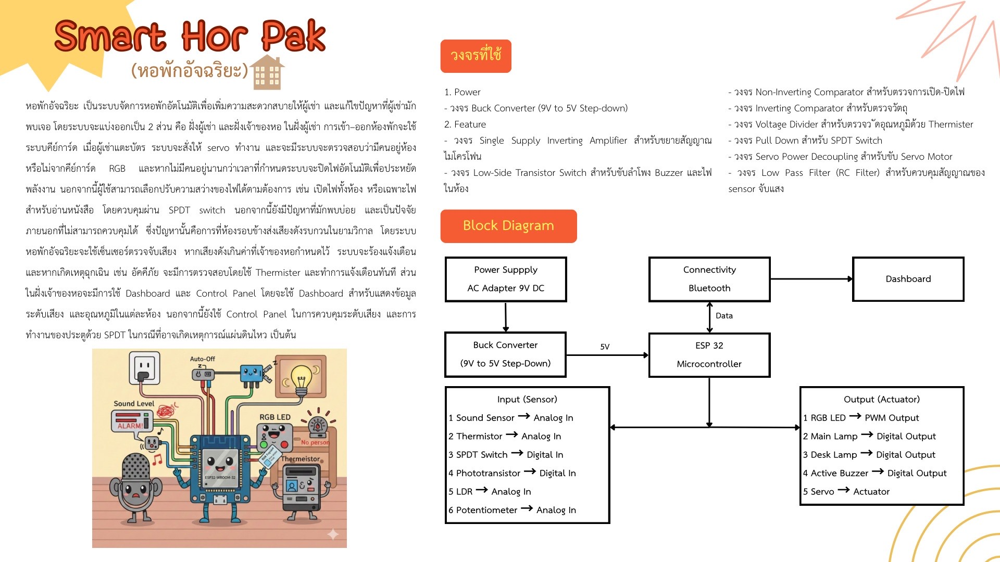

### Smart Dormitory System *(Course Project, Team of 4)*

Developed an IoT-based smart dormitory prototype as part of a four-member team.

**My Contributions**
- Developed embedded software for ESP32 and Arduino.
- Implemented temperature, sound, and occupancy detection using multiple sensors.
- Integrated MQTT communication with a Node-RED dashboard.
- Participated in hardware integration, testing, and debugging.

## Features

- Real-time temperature monitoring using a thermistor
- Sound level detection using a microphone sensor
- Occupancy detection
- Automatic lighting control
- RGB LED status indication
- Servo control
- Buzzer alarm
- Bluetooth Serial communication between ESP32 and Node-RED
- Real-time monitoring through a Node-RED dashboard

## Hardware

### Microcontroller

- ESP32

### Input Sensors

- Sound Sensor
- Thermistor
- SPDT Switch
- Phototransistor
- LDR
- Potentiometer

### Output Devices

- RGB LED
- Main Lamp
- Desk Lamp
- Active Buzzer
- Servo Motor

---

## Software

- Arduino IDE
- ESP32 Arduino Framework
- Node-RED Dashboard
- Bluetooth Communication

---

## Technologies

- C++
- Arduino
- ESP32
- Node-RED
- Embedded Systems
- IoT

---

## Prototype

